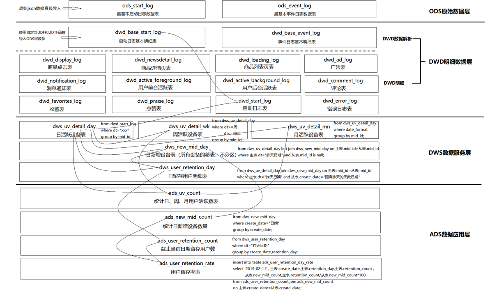

# 业务术语

- **用户**

用户以设备为判断标准，在移动统计中，每个独立设备认为是一个独立用户。Android系统根据IMEI号，IOS系统根据OpenUDID来标识一个独立用户，每部手机一个用户。

- **新增用户**

首次联网使用应用的用户。如果一个用户首次打开某APP，那这个用户定义为新增用户；卸载再安装的设备，不会被算作一次新增。新增用户包括日新增用户、周新增用户、月新增用户。

- **活跃用户**

打开应用的用户即为活跃用户，不考虑用户的使用情况。每天一台设备打开多次会被计为一个活跃用户。

- **周（月）活跃用户**

某个自然周（月）内启动过应用的用户，该周（月）内的多次启动只记一个活跃用户。

- **月活跃率**

月活跃用户与截止到该月累计的用户总和之间的比例。

- **沉默用户**

用户仅在安装当天（次日）启动一次，后续时间无再启动行为。该指标可以反映新增用户质量和用户与APP的匹配程度。

- **版本分布**

不同版本的周内各天新增用户数，活跃用户数和启动次数。利于判断APP各个版本之间的优劣和用户行为习惯。

- **本周回流用户**

上周未启动过应用，本周启动了应用的用户。

- **连续n周活跃用户**

连续n周，每周至少启动一次。

- **忠诚用户**

连续活跃5周以上的用户

- **连续活跃用户**

连续2周及以上活跃的用户

- **近期流失用户**

连续n(2<= n <= 4)周没有启动应用的用户。（第n+1周没有启动过）

- **留存用户**

某段时间内的新增用户，经过一段时间后，仍然使用应用的被认作是留存用户；这部分用户占当时新增用户的比例即是留存率。

例如，5月份新增用户200，这200人在6月份启动过应用的有100人，7月份启动过应用的有80人，8月份启动过应用的有50人；则5月份新增用户一个月后的留存率是50%，二个月后的留存率是40%，三个月后的留存率是25%。

- **用户新鲜度**

每天启动应用的新老用户比例，即新增用户数占活跃用户数的比例。

- **单次使用时长**

每次启动使用的时间长度。

- **日使用时长**

累计一天内的使用时间长度。

- **启动次数计算标准**

IOS平台应用退到后台就算一次独立的启动；Android平台我们规定，两次启动之间的间隔小于30秒，被计算一次启动。用户在使用过程中，若因收发短信或接电话等退出应用30秒又再次返回应用中，那这两次行为应该是延续而非独立的，所以可以被算作一次使用行为，即一次启动。业内大多使用30秒这个标准，但用户还是可以自定义此时间间隔。

- 整个文档中涉及的所有层级及表

