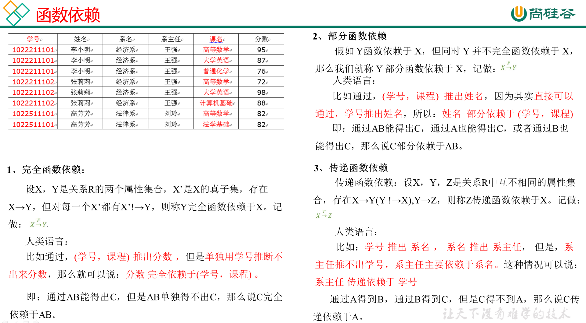
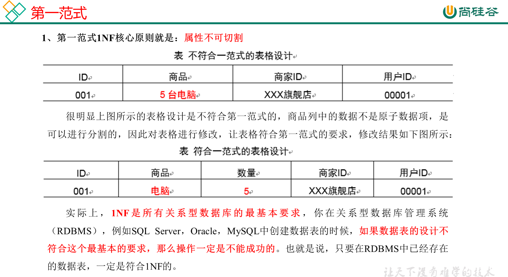
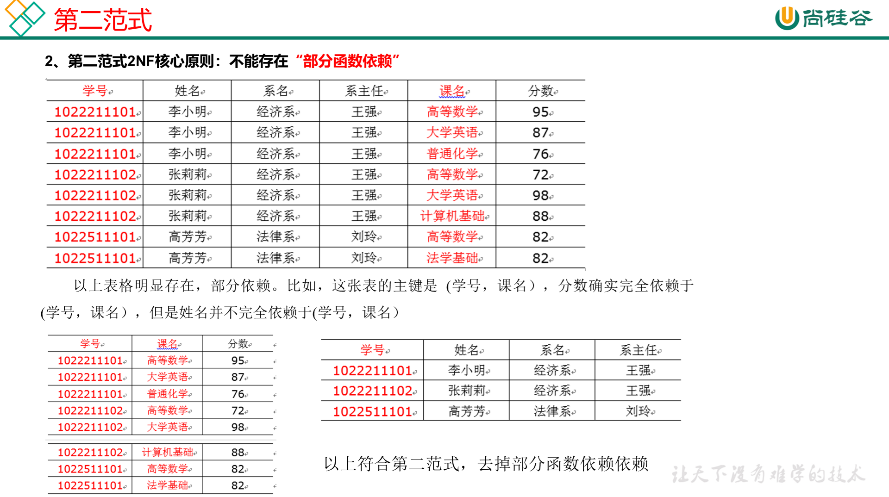
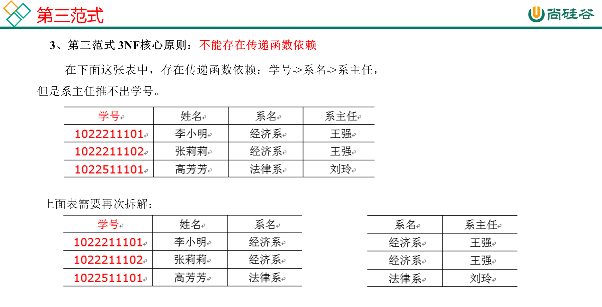
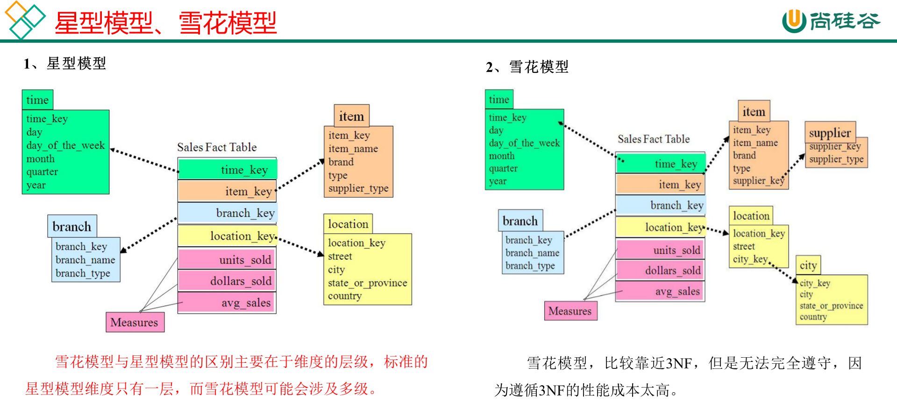
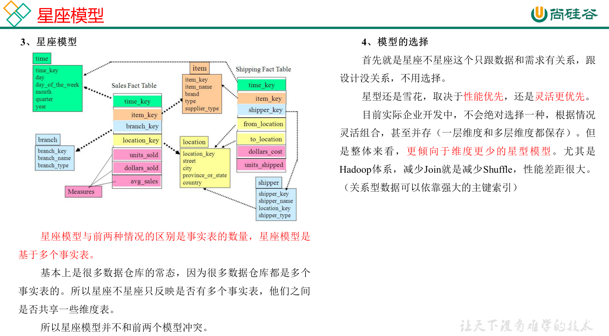

# 数仓理论

## 表的分类

### 实体表

**实体表**，一般是指一个现实存在的业务对象，比如用户，商品，商家，销售员等等

### 维度表

**维度表**，一般是指对应一些业务状态，编号的解释表。也可以称之为码表。

比如地区表，订单状态，支付方式，审批状态，商品分类等等

### 事务型事实表

**事务型事实表**，一般指随着业务发生不断产生的数据。特点是一旦发生不会再变化。

一般比如，交易流水，操作日志，出库入库记录等等

### 周期型事实表

**周期型事实表**，一般指随着业务发生不断产生的数据。

与事务型不同的是，数据会随着业务周期性的推进而变化。

 比如订单，其中订单状态会周期性变化。再比如，请假、贷款申请，随着批复状态在周期性变化。

## 同步策略

数据同步策略的类型包括：全量表、增量表、新增及变化表、拉链表

Ø 全量表：存储完整的数据。

Ø 增量表：存储新增加的数据。

Ø 新增及变化表：存储新增加的数据和变化的数据。

Ø 拉链表：对新增及变化表做定期合并

### 实体表同步策略

实体表：比如用户，商品，商家，销售员等

实体表数据量比较小：通常可以做每日全量，就是每天存一份完整数据。即每日全量

### 维度表同步策略

维度表：比如订单状态，审批状态，商品分类

维度表数据量比较小：通常可以做每日全量，就是每天存一份完整数据。即每日全量。

说明：

1）针对可能会有变化的状态数据可以存储每日全量。

2）没变化的客观世界的维度（比如性别，地区，民族，政治成分，鞋子尺码）可以只存一份固定值。

### 事务型事实表同步策略

事务型事实表：比如，交易流水，操作日志，出库入库记录等。

因为数据不会变化，而且数据量巨大，所以每天只同步新增数据即可，所以可以做成每日增量表，即每日创建一个分区存储

### 周期型事实表同步策略

周期型事实表：比如，订单、请假、贷款申请等

这类表从数据量的角度，存每日全量的话，数据量太大，冗余也太大。如果用每日增量的话无法反应数据变化。

 每日新增及变化量，包括了当日的新增和修改。一般来说这个表，足够计算大部分当日数据的。但是这种依然无法解决能够得到某一个历史时间点（时间切片）的切片数据。 

 所以要用利用每日新增和变化表，制作一张拉链表，以方便的取到某个时间切片的快照数据。所以我们需要得到每日新增及变化量

拉链表：

| name姓名 | start新名字创建时间 | end名字更改时间 |
| -------- | ------------------- | --------------- |
| 张三     | 1990/1/1            | 2018/12/31      |
| 张小三   | 2019/1/1            | 2019/4/30       |
| 张大三   | 2019/5/1            | 9999-99-99      |
| 。。。   | 。。。              | 。。。          |

```sql
select * from user where start =<’2019-1-2’ and end>=’2019-1-2’
```

## 范式理论

### 范式概念

关系型数据库设计时，遵照一定的规范要求，目的在于降低数据的冗余性，目前业界范式有：第一范式(1NF)、第二范式(2NF)、第三范式(3NF)、巴斯-科德范式(BCNF)、第四范式(4NF)、第五范式(5NF)。

范式可以理解为一张数据表的表结构，符合的设计标准的级别。

 使用范式的根本目的是：

 1）减少数据冗余，尽量让每个数据只出现一次。

 2）保证数据一致性

 缺点是获取数据时，需要通过Join拼接出最后的数据。

### 函数依赖



### 三范式区分







## 关系建模与维度建模

关系模型主要应用与OLTP系统中，为了保证数据的一致性以及避免冗余，所以大部分业务系统的表都是遵循第三范式的。

维度模型主要应用于OLAP系统中，因为关系模型虽然冗余少，但是在大规模数据，跨表分析统计查询过程中，会造成多表关联，这会大大降低执行效率。

所以把相关各种表整理成两种：事实表和维度表两种。所有维度表围绕着事实表进行解释。

## 雪花模型、星型模型和星座模型

在维度建模的基础上又分为三种模型：星型模型、雪花模型、星座模型



